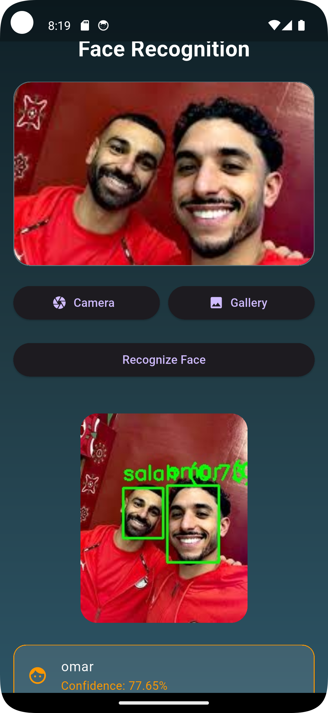

# AI Face Recognition System with Mobile Integration

## Overview

This project is a complete Face Recognition System powered by deep learning and integrated with a mobile application (Flutter).

The system performs face detection, feature extraction, and identity matching using embedding-based techniques. The backend communicates with a mobile application through an API to deliver real-time recognition results.

This project was developed as part of a Postgraduate in Computer Science / Artificial Intelligence.

---

## Key Features

* Real-time face detection
* Deep learning-based face recognition using InsightFace
* Embedding-based matching using cosine similarity
* Configurable similarity threshold
* Mobile application integration (Flutter)
* API-based communication
* Modular and scalable architecture

---

## System Architecture

Mobile Application (Flutter)
↓
Backend API (Flask / FastAPI)
↓
Face Detection → Face Embedding → Matching → Result

---

## Workflow

1. Capture image from mobile application
2. Send image to backend API
3. Detect faces in the image
4. Extract embeddings using deep learning model
5. Compare with stored embeddings
6. Return identity and confidence score
7. Display result on mobile application

---

## Core Components

### Face Detection

* Implemented using face_recognition library
* Supports:

  * HOG model (CPU - faster)
  * CNN model (GPU - more accurate)

### Face Recognition

* Implemented using InsightFace
* Model used: buffalo_l
* Extracts high-quality facial embeddings

### Embedding Matching

* Uses cosine similarity for comparison
* Returns best match with confidence score
* Threshold-based classification

### Embedding Storage

* Stores embeddings and corresponding labels
* Supports loading saved embeddings
* Efficient matching process

### Mobile Integration

* Built using Flutter
* Sends images via HTTP requests
* Displays recognition results in real-time

---

## Tech Stack

### Backend

* Python
* OpenCV
* NumPy
* InsightFace
* face_recognition
* Flask / FastAPI

### Mobile

* Flutter
* HTTP API

---

## Project Structure

Face_Auth_System_Update/
│
├── database/
│   ├── embeddings_store.py
│   ├── embeddings.pkl
│
├── detector/
│   ├── face_detector.py
│
├── recognition/
│   ├── face_recognizer.py
│
├── utils/
│   ├── image_utils.py
│
├── app.py
├── requirements.txt
├── README.md

---

## Installation

Clone the repository:

git clone https://github.com/ibrahim-mosaad/face-auth-system
cd face-auth-system

Install dependencies:

pip install -r requirements.txt

---

## Running the Backend

python app.py

Or using FastAPI:

uvicorn app:app --reload

---

## Mobile Application Setup

1. Open the Flutter project
2. Set API endpoint:

http://YOUR_IP:PORT/predict

3. Run the application on emulator or real device

---

## 🎥 Demo

---

## Performance

* Model: InsightFace (buffalo_l)
* Similarity Metric: Cosine Similarity
* Threshold: 0.55 (configurable)
* Supports real-time recognition

---

## Notes

* Dataset is not included due to size and privacy
* Embeddings are stored locally
* Backend server must be running before using the mobile app

---

## Future Improvements

* Add face anti-spoofing (liveness detection)
* Deploy system to cloud (AWS / Azure)
* Integrate database (MongoDB / PostgreSQL)
* Improve model accuracy using advanced architectures
* Optimize for mobile and edge devices

---

## Research Potential

This project can be extended into research areas such as:

* Face recognition robustness
* Performance under different lighting conditions
* Anti-spoofing techniques
* Real-world biometric authentication systems

---

## Author

Ibrahim Hamada Mosaad 
AI Engineer | Computer Vision

GitHub: https://github.com/ibrahim-mosaad
LinkedIn: https://www.linkedin.com/in/ibrahim-hamada-mosaad-a91a66170/

---

## License

This project is for educational and research purposes.
